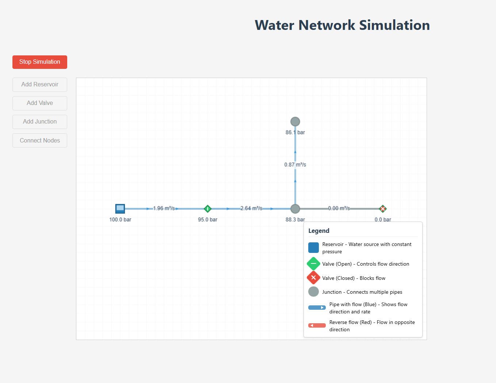

# Water Network Flow Simulation

A real-time interactive fluid dynamics simulation for water distribution networks. This web application allows users to design, build, and analyze water network systems with an intuitive visual interface.



## Features

- **Interactive Network Builder**: Create complex water networks by adding reservoirs, valves, and junctions
- **Real-time Simulation**: Visualize water flow and pressure changes throughout the network
- **Valve Control**: Open/close valves to control flow and observe the effects on the system
- **Parameter Adjustment**: Modify reservoir pressures and pipe diameters to optimize network performance
- **Visual Feedback**: Color-coded flow direction and pressure indicators
- **Responsive Canvas**: Pan and zoom to navigate large network layouts

## Physics Model

The application implements a simplified fluid dynamics model that includes:

- Pressure propagation through connected nodes
- Flow rate calculation based on pressure differentials
- Resistance effects from pipe diameter (based on Darcy-Weisbach principles)
- Valve state effects on network connectivity and pressure isolation
- Iterative convergence for stable pressure distribution

## Technologies

- **React** - Frontend UI library
- **TypeScript** - Type-safe programming
- **Redux** - State management
- **HTML5 Canvas** - High-performance rendering
- **CSS3** - Styling and animations

## Getting Started

### Prerequisites

- Node.js (v14.0 or higher)
- npm or yarn

### Installation

1. Clone the repository
   ```
   git clone https://github.com/yourusername/fluid-simulation.git
   cd fluid-simulation
   ```

2. Install dependencies
   ```
   npm install
   ```

3. Start the development server
   ```
   npm start
   ```

4. Open your browser to `http://localhost:3000`
